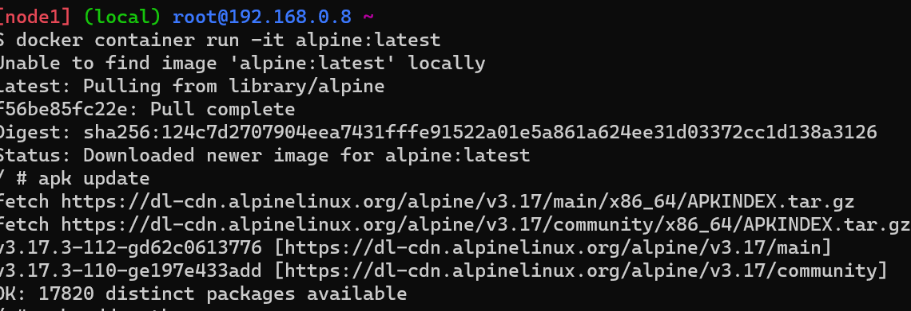
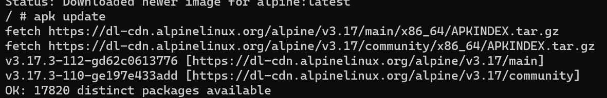
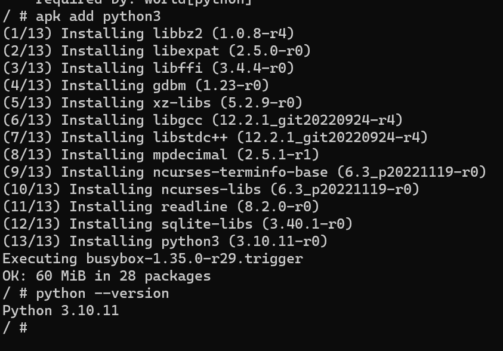

### Python install on Interactvice
* Docker install on linux follow below commands

```
 curl -fsSL https://get.docker.com -o get-docker.sh
 sh get-docker.sh
 sudo usermod -aG docker ubuntu
 exit and re-login
 ```

* _`docker container run -it alpine:latest`_  to run this command on windows

* Then its goto interactive mode use `apk update`

* Next install python on root user use these commands `apk add python3`

* And then check python version
    _it gives Pyhon 3.10.11_
* 

