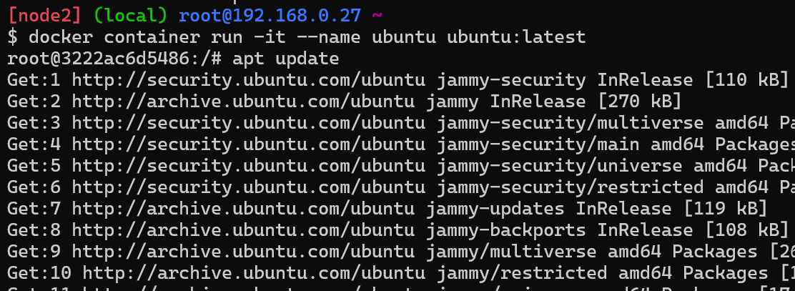
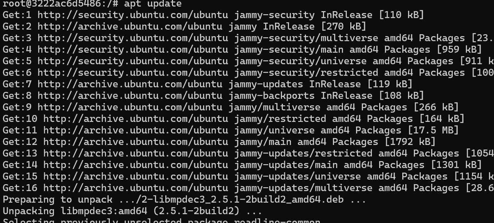
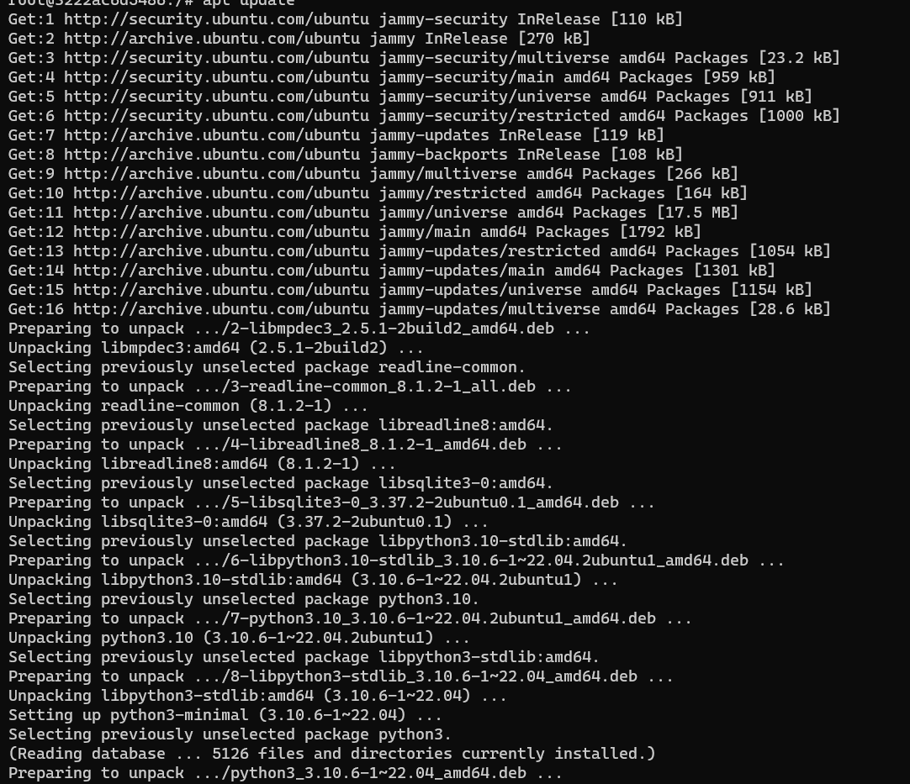
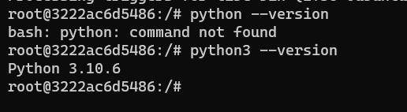

### Install PYTHON on ubuntu on Docker Image

* If we take ubuntu machine install docker on ubuntu machine
* (OR) If we take one machine on Docker Playground
* And Execute  These command `docker container run -it --name ubuntu ubuntu:latest`

* and next follow use these commands
*  `apt update`

* `apt install python3 -y`
 
* `python3 --version`
