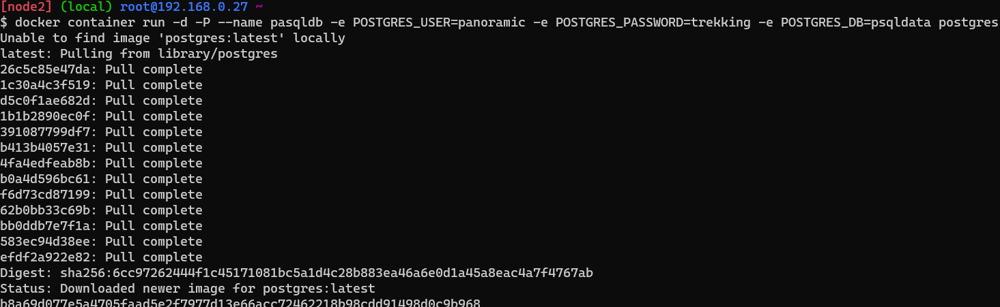
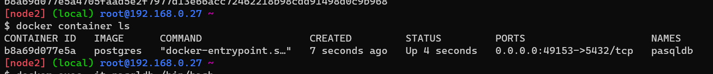
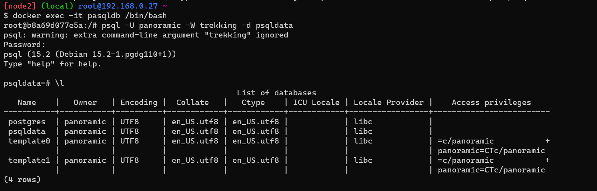
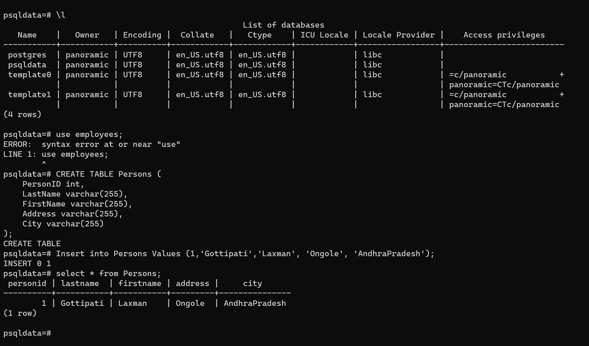

### Create a postgress container and Lgin DataBase services

* Let's create an postgres container with user panoramic and password as trekking
* Take a EC2 Machine
* Install Docker (or) using Docker playdround
    * Follow the below commands
 `docker container run -d -P --name pasqldb -e POSTGRES_USER=panoramic -e POSTGRES_PASSWORD=trekking -e POSTGRES_DB=psqldata postgres`
  

`docker container ls`


`docker exec -it pasqldb /bin/bash`


```
psqldata=#  use employees;

psqldata=#  CREATE TABLE Persons (
              PersonID int,
              LastName varchar(255),
              FirstName varchar(255),
              Address varchar(255),
              City varchar(255)
            );

psqldata=#  Insert into Persons Values (1,'Gottipati','laxman', 'Ongole', 'AndhraPradesh');

psqldata=#   select * from Persons;

```


