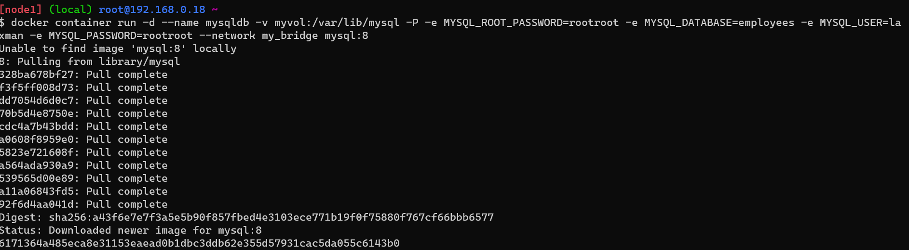
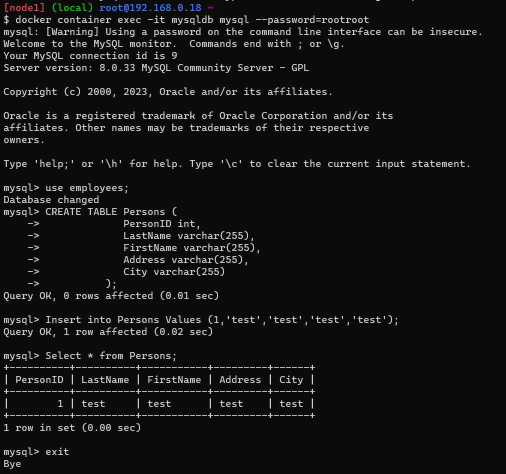
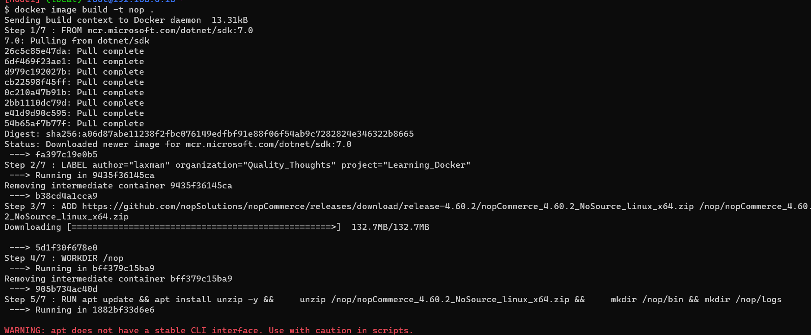
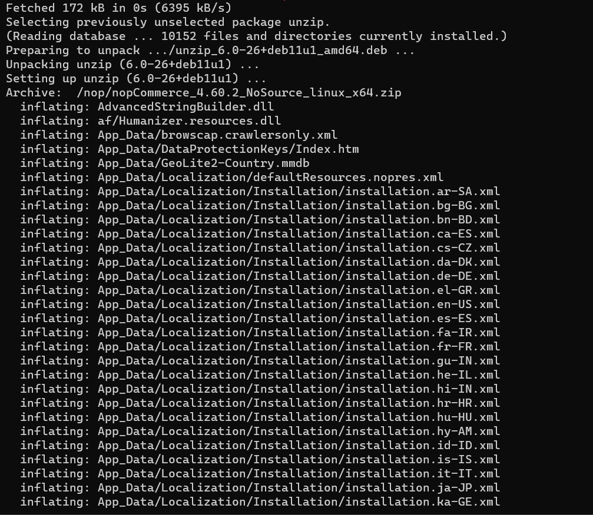
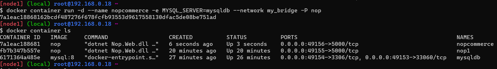
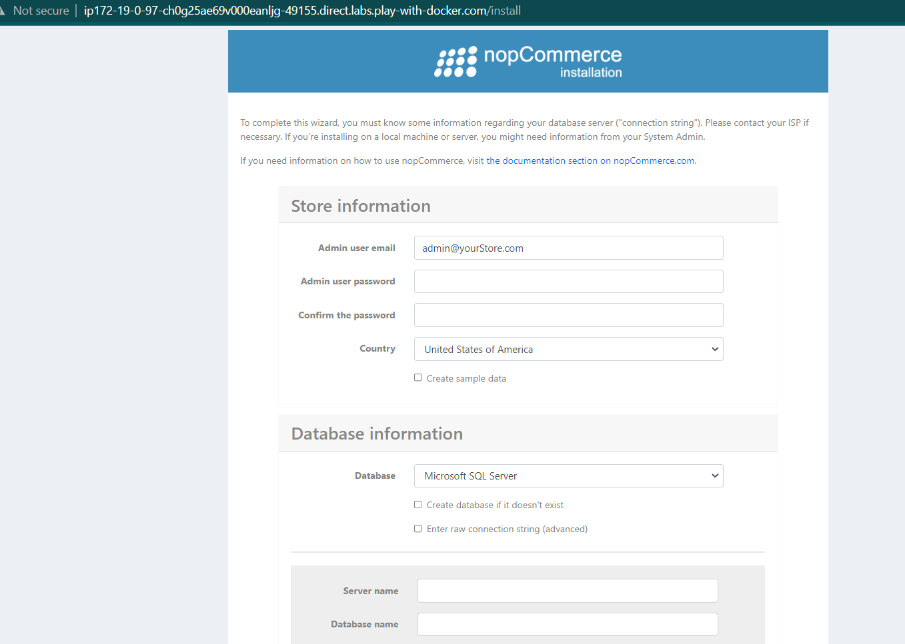
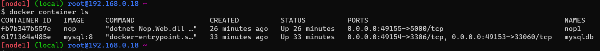
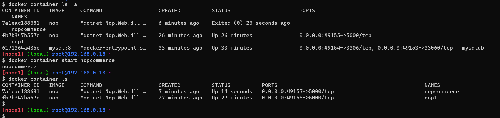
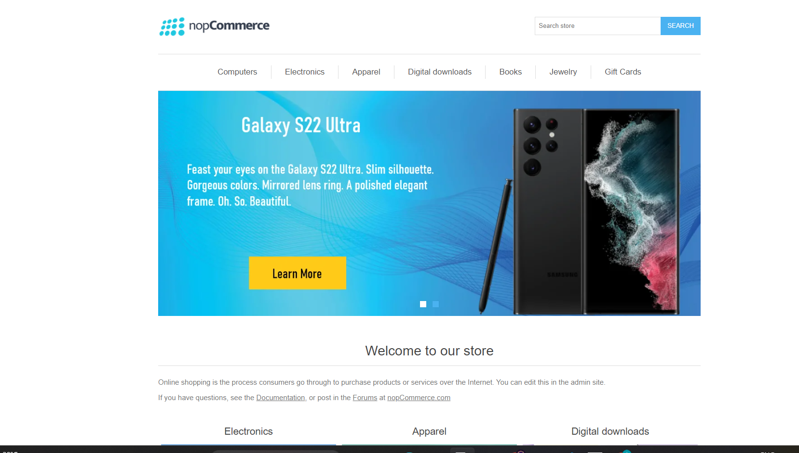

### Create Nopcommerce using mysql server


* docker volume create my_vol
* docker network create -d bridge my_bridge

* docker container run -d --name mysqldb -v myvol:/var/lib/mysql -P -e MYSQL_ROOT_PASSWORD=rootroot -e MYSQL_DATABASE=employees -e MYSQL_USER=laxman -e MYSQL_PASSWORD=rootroot --network my_bridge mysql:8

* docker container exec -it mysqldb mysql --password=rootroot


* mysql> use employees;

* mysql>  CREATE TABLE Persons (
           PersonID int,
           LastName varchar(255),
           FirstName varchar(255),
           Address varchar(255),
           City varchar(255)
        );

* mysql> Insert into Persons Values (1,'test','test','test','test');

* mysql> Select * from Persons;

* vi Dockerfile
  
```Dockerfile 
FROM mcr.microsoft.com/dotnet/sdk:7.0
LABEL author="laxman" organization="Quality_Thoughts" project="Learning_Docker"
ADD https://github.com/nopSolutions/nopCommerce/releases/download/release-4.60.2/nopCommerce_4.60.2_NoSource_linux_x64.zip /nop/nopCommerce_4.60.2_NoSource_linux_x64.zip
WORKDIR /nop
RUN apt update && apt install unzip -y && \
    unzip /nop/nopCommerce_4.60.2_NoSource_linux_x64.zip && \
    mkdir /nop/bin && mkdir /nop/logs
EXPOSE 5000
CMD [ "dotnet", "Nop.Web.dll", "--urls", "http://0.0.0.0:5000" ]
```
* docker image build -t nop .


* docker container run -d --name mynopcommerse -e MYSQL_SERVER=mysql --network my_bridge -P nop  

  

* In these above image application fill the details `user_name, password, server_name, passwd, SQLusername, SQLpasswd `
* Create the application
* Once create the application application application will restart automatically.
* Then this application will stoped automatically...

* we use these command `docker container start nopcommerce` 
     then the application will start
     
* then check the port number on sever.



