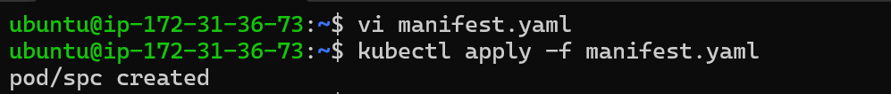
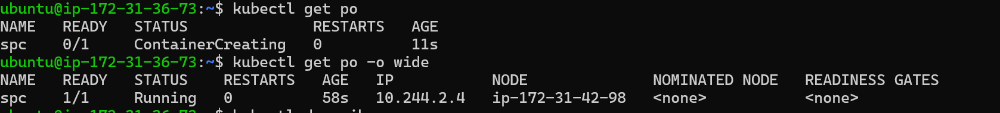
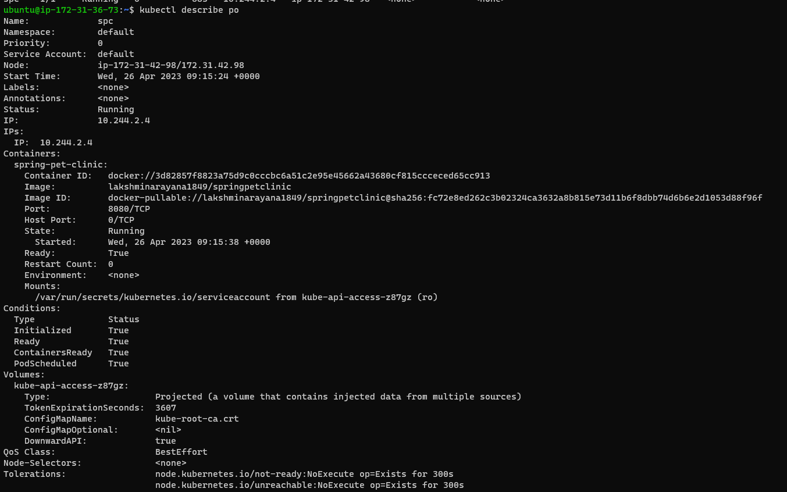
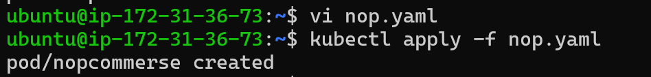
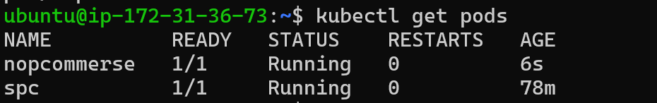
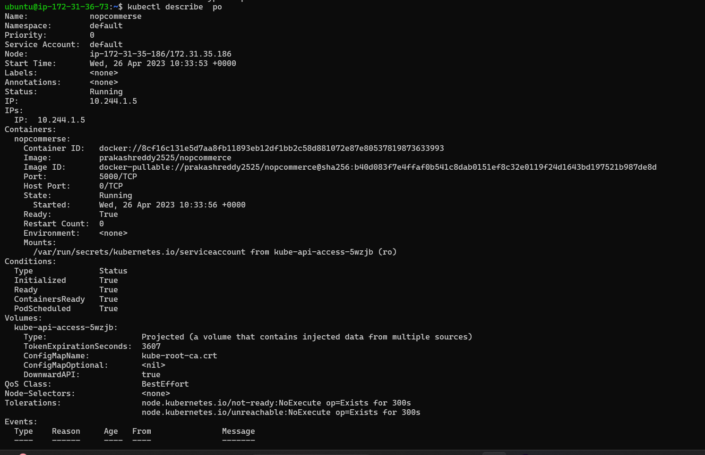

### Write a Pod Spec for SpringPetclinic (manifest file)
* Take two ec2 instances and install docker and kuberneties on these EC2 instances.
* Create manifest file
    * Take one file with end of .yaml  
```yaml
---
apiVersion: v1
kind: Pod
metadata:
  name: spc
spec:
  containers:
    - name: spring-pet-clinic
      image: lakshminarayana1849/springpetclinic
      ports:
        - containerPort: 8080
``` 
* Go to terminal and paste the above content on `vi<file name>`
* Next these command is used to create `pods`
* `kubectl apply -f <file name>`

* `kubectl get pods -o wide`

* `kubectl describe po`



### Write a Pod Spec for Nopcommerse (manifest file)
* Take two ec2 instances and install docker and kuberneties on these EC2 instances.
* Create manifest file
    * Take one file with end of .yaml

```yaml
---
apiVersion: v1
kind: Pod
metadata:
  name: nopcommerse
spec:
  containers:
    - name: nopcommerse
      image: prakashreddy2525/nopcommerce
      ports:
        - containerPort: 5000  
```

* Go to terminal and paste the above content on `vi<file name>`
* Next these command is used to create `pods`
* `kubectl apply -f <file name>`

* `kubectl get pods -o wide`

* `kubectl describe po`


