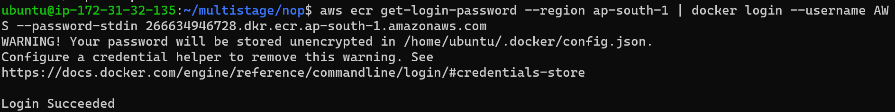

### Create Multistage on 'NOPCOMMERSE' 

* Take one EC2 instance and install _docker_ on this machine 
*  Use these these commands 
   ```
    curl -fsSL https://get.docker.com -o get-docker.sh
    sh get-docker.sh
    sudo usermod -aG docker ubuntu
   ```
* Crate one folder `nopcommerse`
* vi Dockerfile
``` Dockerfile
FROM ubuntu:22.04 AS builder
RUN apt update && apt install unzip -y
ADD https://github.com/nopSolutions/nopCommerce/releases/download/release-4.60.2/nopCommerce_4.60.2_NoSource_linux_x64.zip /nop_dot/nopCommerce_4.60.2_NoSource_linux_x64.zip
RUN cd nop_dot && unzip nopCommerce_4.60.2_NoSource_linux_x64.zip

FROM mcr.microsoft.com/dotnet/sdk:7.0
LABEL author="laxman" organization="QualityThought"
COPY --from=builder nop_dot nop_ecommerse
WORKDIR /nop_ecommerse
EXPOSE 5000
CMD [ "dotnet", "Nop.Web.dll", "--urls", "http://0.0.0.0:5000" ]

```
* RUN this command for build image`docker image build -t nopcommerse .`

* Run these command for container `docker container run -d --name nop -P nopcommerse`


* Next in these above image to push into `AWS>>ECR` follow thse steps (on above ubuntu machine)
    * Requirements 
      * aws cli   >> use `sudo apt install aws cli` 
      * aws configure 
          * accesskey ()
          * secreatkey ()
* Create one ECR repository follow these steps


 click the create repository


* follow these above commands to push image to our ECR repository
* `aws ecr get-login-password --region ap-south-1 | docker login --username AWS --password-stdin 266634946728.dkr.ecr.ap-south-1.amazonaws.com`


* `docker build -t nopcommerse .` these or optional
* `docker tag nopcommerse:latest 266634946728.dkr.ecr.ap-south-1.amazonaws.com/nopcommerse:latest`

`docker push 266634946728.dkr.ecr.ap-south-1.amazonaws.com/nopcommerse:latest`


* Then the image push into our repo as above image